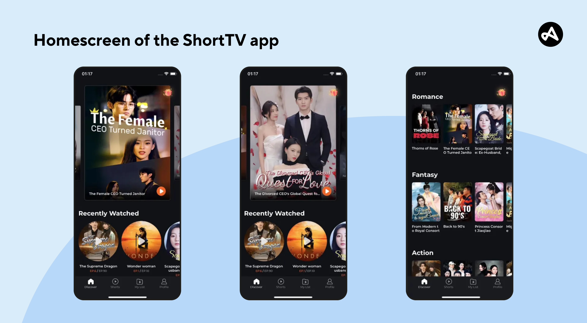
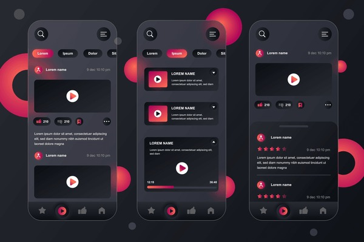

# ✨ Starlight Shorts

> 一个现代化的短剧平台，为用户提供沉浸式的短视频观看体验

[](https://github.com/LTH1016/starlight-shorts/stargazers)
[](https://github.com/LTH1016/starlight-shorts/network/members)
[](https://github.com/LTH1016/starlight-shorts/issues)
[](https://opensource.org/licenses/MIT)

## 🌟 项目简介

Starlight Shorts 是一个专为短剧内容打造的现代化平台，结合了最新的前端技术和优雅的用户界面设计。项目提供完整的全栈解决方案，包括用户认证、内容管理、社交互动等核心功能。

### 🎯 核心特色

- 🎬 **沉浸式观看体验** - 优化的视频播放器和流畅的用户界面
- 📱 **响应式设计** - 完美适配桌面端、平板和移动设备
- 🔍 **智能搜索** - 强大的内容发现和推荐系统
- 👥 **社交互动** - 评论、点赞、分享等社交功能
- 🚀 **高性能** - 基于现代技术栈的快速加载体验

## 📁 项目结构

```
starlight-shorts/
├── 🎭 drama-platform/          # 核心平台代码
│   ├── 🎨 frontend/            # React + TypeScript 前端
│   ├── ⚙️ backend/             # Node.js + Express 后端
│   ├── 🐳 docker-compose.yml   # Docker 部署配置
│   └── 📖 README.md           # 平台详细文档
├── 📚 docs/                   # 项目文档
│   ├── 🎨 design_guide.md     # 设计规范指南
│   ├── 🔧 technical_analysis.md # 技术分析报告
│   └── 📋 research_plan.md    # 研究计划文档
├── 🖼️ imgs/                   # 设计参考资源
└── 📝 todo.md                 # 开发计划
```

## 🚀 快速开始

### 环境要求

- **Node.js** 18.0+
- **MongoDB** 6.0+
- **Redis** 6.0+
- **Docker** (推荐)

### 一键启动

```bash
# 克隆项目
git clone https://github.com/LTH1016/starlight-shorts.git
cd starlight-shorts/drama-platform

# 使用 Docker 启动 (推荐)
npm start

# 或者手动启动
npm run install:all  # 安装所有依赖
npm run dev          # 启动开发环境
```

### 访问地址

- 🌐 **前端应用**: http://localhost:5174
- 🔧 **后端 API**: http://localhost:3001
- 📖 **API 文档**: http://localhost:3001/api-docs

## 🛠️ 技术栈

### 前端技术

| 技术 | 版本 | 用途 |
|------|------|------|
| React | 18+ | 用户界面框架 |
| TypeScript | 5+ | 类型安全 |
| Vite | 6+ | 构建工具 |
| Tailwind CSS | 3+ | 样式框架 |
| Radix UI | 最新 | UI 组件库 |

### 后端技术

| 技术 | 版本 | 用途 |
|------|------|------|
| Node.js | 18+ | 运行时环境 |
| Express.js | 4+ | Web 框架 |
| MongoDB | 6+ | 数据库 |
| Redis | 6+ | 缓存系统 |
| JWT | - | 身份认证 |

## 🎬 功能特性

### 🎯 核心功能

- ✅ **短剧浏览** - 分类浏览、搜索筛选
- ✅ **视频播放** - 高质量播放器，支持多种格式
- ✅ **用户系统** - 注册登录、个人中心
- ✅ **社交互动** - 评论、点赞、收藏
- ✅ **内容管理** - 上传、编辑、管理短剧内容
- ✅ **推荐系统** - 智能内容推荐算法

### 🔧 技术特性

- ✅ **全栈 TypeScript** - 类型安全的开发体验
- ✅ **RESTful API** - 标准化的接口设计
- ✅ **响应式设计** - 移动端优先的设计理念
- ✅ **Docker 部署** - 容器化的部署方案
- ✅ **缓存优化** - Redis 缓存提升性能
- ✅ **安全认证** - JWT 令牌安全机制

## 📱 界面预览

<div align="center">
  
  
</div>

## 🚀 部署指南

### Docker 部署 (推荐)

```bash
# 进入项目目录
cd drama-platform

# 启动所有服务
docker-compose up -d

# 查看服务状态
docker-compose ps

# 查看日志
docker-compose logs -f
```

### 手动部署

```bash
# 1. 安装依赖
npm run install:all

# 2. 构建项目
npm run build

# 3. 启动服务
npm start
```

## 📖 开发文档

- 📋 [功能需求分析](docs/research_plan_short_drama_website.md)
- 🎨 [设计规范指南](docs/design_guide.md)
- 🔧 [技术架构分析](docs/technical_analysis.md)
- 📊 [项目最终报告](docs/final_report.md)

## 🤝 贡献指南

我们欢迎所有形式的贡献！请查看 [贡献指南](CONTRIBUTING.md) 了解详情。

### 开发流程

1. **Fork** 本仓库
2. **创建** 功能分支 (`git checkout -b feature/amazing-feature`)
3. **提交** 更改 (`git commit -m 'Add amazing feature'`)
4. **推送** 到分支 (`git push origin feature/amazing-feature`)
5. **创建** Pull Request

## 📄 许可证

本项目基于 [MIT 许可证](LICENSE) 开源。

## 👥 团队

- **项目负责人**: [@LTH1016](https://github.com/LTH1016)
- **前端开发**: React + TypeScript 技术栈
- **后端开发**: Node.js + MongoDB 技术栈
- **UI/UX 设计**: 现代化响应式设计

## 🔗 相关链接

- 🌐 [在线演示](https://starlight-shorts.vercel.app) (即将上线)
- 📖 [API 文档](https://api.starlight-shorts.com/docs) (即将上线)
- 🎨 [设计系统](https://design.starlight-shorts.com) (即将上线)
- 📱 [移动端应用](https://app.starlight-shorts.com) (即将上线)

## 🌟 致谢

感谢所有为这个项目做出贡献的开发者和设计师！

---

<div align="center">
  <strong>✨ Starlight Shorts - 让每个短剧都闪闪发光 ✨</strong>
  <br>
  <sub>Built with ❤️ by the Starlight team</sub>
</div>
